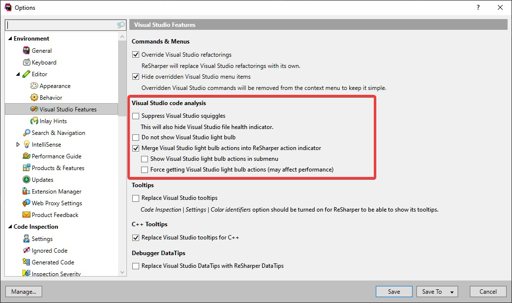

## WHY THIS PROJECT IS ARCHIVED - EXPLANATION
------------------------------
MappingGenerator is discontinued in the form of FOSS. I spent the last three months (March 2021 - June 2021) working hard on improving MappingGenerator. I solved many issues and added a bunch of new cool features. I also made a general refactoring which restored the project maintainability. All of that cost me a lot of my private time and I did it all by myself, so I decided to convert MappingGenerator into a commercial product. A perpetual license for a new version of MappingGenerator can be obtained via the official product website https://www.mappinggenerator.net/

I would like to thank all of you who contributed to this product by reporting issues, testing, authoring PRs, or buying me coffee. **PR authors (except the Only README Updaters) and Coffee Buyers will be awarded with a special license for MappingGenerator for free -  I will send them an email with details in a few days.**

🔥 Important Links: 

- Product page https://www.mappinggenerator.net/
- Download page for VS2017 and VS2019 https://marketplace.visualstudio.com/items?itemName=54748ff9-45fc-43c2-8ec5-cf7912bc3b84.mappinggenerator
- Download page for VS2022 https://marketplace.visualstudio.com/items?itemName=54748ff9-45fc-43c2-8ec5-cf7912bc3b84.MappingGenerator2022
- Current release notes https://github.com/cezarypiatek/MappingGeneratorReleases/releases
- New Issue Tracker https://github.com/cezarypiatek/MappingGeneratorIssueTracker

------------------------------

# Mapping Generator [](https://twitter.com/intent/tweet?text="AutoMapper"%20ike,%20Roslyn%20based,%20code%20fix%20provider%20that%20allows%20to%20generate%20mapping%20code%20in%20design%20time.&related=@cezary_piatek&url=https://github.com/cezarypiatek/MappingGenerator)  


"AutoMapper" like, Roslyn based, code fix provider that allows to generate mapping code in design time. Read more [Mapping Generator – Design Time Alternative to AutoMapper](https://guidnew.com/en/blog/mapping-generator-design-time-alternative-to-automapper/)

You can download it as Visual Studio Extension from [Visual Studio Marketplace](https://marketplace.visualstudio.com/items?itemName=54748ff9-45fc-43c2-8ec5-cf7912bc3b84.mappinggenerator).

## Motivation
[The reasons behind why I don't use AutoMapper](https://cezarypiatek.github.io/post/why-i-dont-use-automapper/)


### Contributing
Before you start any contributing work, please read the [contribution guideline](/docs/CONTRIBUTING.md)

### Supported IDE

#### VisualStudio.
Install as VSIX from [Market place](https://marketplace.visualstudio.com/items?itemName=54748ff9-45fc-43c2-8ec5-cf7912bc3b84.mappinggenerator) or as a [NuGet package](https://www.nuget.org/packages/MappingGenerator/). Verify your [Roslyn integration option in case you are using R#](#using-along-with-resharper).

#### JetBrains Rider
Install as a [NuGet package](https://www.nuget.org/packages/MappingGenerator/)

#### VSCode
Install as a [NuGet package](https://www.nuget.org/packages/MappingGenerator/) or use [this instruction](https://www.strathweb.com/2017/05/using-roslyn-refactorings-with-omnisharp-and-visual-studio-code/) to install from [VSIX](https://marketplace.visualstudio.com/items?itemName=54748ff9-45fc-43c2-8ec5-cf7912bc3b84.mappinggenerator)

### Using along with Resharper

If you are not able to open Roslyn refactoring menu (`ctr + .`) please verify your Resharper settings related to `Visual Studio Integration` or `Visual Studio code analysis` (depends on the R# version). For more information please check [#50](https://github.com/cezarypiatek/MappingGenerator/issues/50)



## Main features

### Generate mapping method body

#### Pure mapping method
Non-void method that takes single parameter

```csharp
public UserDTO Map(UserEntity entity)
{
    
}
```


#### Updating method
Void method that takes two parameters
```csharp
public void Update(UserDTO source, UserEntity target)
{
    
}
```


#### Mapping Constructor
Constructor method that takes single complex parameter

```csharp
public UserDTO(UserEntity user)
{
    
}
```


Constructor method that takes more than one parameter

```csharp
public UserDTO(string firstName, string lastName, int age, int cash)
{
}
```


#### Updating member method
Void member method that takes single parameter
```csharp
public void UpdateWith(UserEntity en)
{
    
}
```


Void member method with more than one parameter
```csharp
public void Update(string firstName, string lastName, int age)
{
}
```


### Generate inline code for fixing Compiler Errors: 
[CS0029](https://docs.microsoft.com/en-us/dotnet/csharp/language-reference/compiler-messages/cs0029) Cannot implicitly convert type 'type' to 'type'


[CS0266](https://docs.microsoft.com/en-us/dotnet/csharp/language-reference/compiler-messages/cs0266) Cannot implicitly convert type 'type1' to 'type2'. An explicit conversion exists (are you missing a cast?)


CS7036 There is no argument given that corresponds to the required formal parameter 


## Other mappings

- Complete empty initialization block


- Complete empty initialization block in lambda expression `Expression<Func<T,T2>> = (T) => new T2{}`


- Provide local accessible variables as parameters for method and constructor invocation


- Create missing mapping lambda  


-  Generate ICloneable interface implementation
 

## Object scaffolding


## Mapping rules
- Mapping Property-To-Property
  ```csharp
  target.FirstName = source.FirstName;
  target.LastName = source.LastName;
  ```
- Mapping Method Call-To-Property
  ```csharp
  target.Total = source.GetTotal()
  ```
- Flattening with sub-property
  ```csharp
  target.UnitId = source.Unit.Id
  ```
- Mapping complex property
  ```csharp
   target.MainAddress = new AddressDTO(){
  	BuildingNo = source.MainAddress.BuildingNo,
  	City = source.MainAddress.City,
  	FlatNo = source.MainAddress.FlatNo,
  	Street = source.MainAddress.Street,
  	ZipCode = source.MainAddress.ZipCode
  };
  ```
- Mapping collections
  ```csharp
  target.Addresses = source.Addresses.Select(sourceAddresse => new AddressDTO(){
    BuildingNo = sourceAddresse.BuildingNo,
    City = sourceAddresse.City,
    FlatNo = sourceAddresse.FlatNo,
    Street = sourceAddresse.Street,
    ZipCode = sourceAddresse.ZipCode
  }).ToList().AsReadOnly();
  ```
- Unwrapping wrappers 
  ```csharp
  customerEntity.Kind = cutomerDTO.Kind.Selected;
  ```
  
  ```csharp
    public enum CustomerKind
    {
        Regular,
        Premium
    }

    public class Dropdown<T>
    {
        public List<T> AllOptions { get; set; }

        public T Selected { get; set; }
    }

    public class CustomerDTO
    {
        public string Name { get; set; }
        public Dropdown<CustomerKind> Kind { get; set; }
    }

    public class UserEntity
    {
        public string Name { get; set; }
        public CustomerKind Kind { get; set; }
    }
  ```
- Using existing direct mapping constructor
  ```csharp
  target.MainAddress = new AddressDTO(source.MainAddress);
  ```

- using existing multi-parameter constuctor
  ```csharp
  this.User =  new UserDTO(firstName: entity.FirstName, lastName: entity.LastName, age: entity.Age);
  ```

